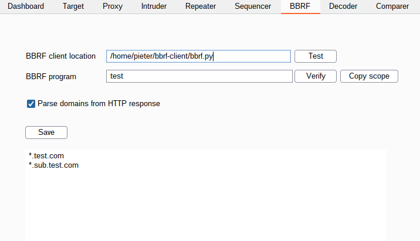

# bbrf-burp-plugin

## What's BBRF?

The Bug Bounty Reconnaissance Framework (BBRF) is intended to facilitate the workflows of security researchers across multiple devices.
  
For more information about BBRF, read the blog post on https://honoki.net/2020/10/08/introducing-bbrf-yet-another-bug-bounty-reconnaissance-framework/

## What's the plugin for?

The Burp plugin enables easy integration of your daily testing in Burp Suite with your personal BBRF server.

### Features

* Specify the program name in the BBRF tab in Burp Suite;
* Verify the installation works by clicking the "Verify" button - if the configuration works, you should see the `inscope` of your program appear in the text field below.
* Automatically (passive) scan all HTTP responses for possible subdomains and send them to the BBRF client which will automatically weed out the inscope or outscope domains and send them to your server;
* Select and right-click a number of domains or urls and use the menu item "Send to BBRF" to store them in your database;
* Use the "Copy scope" button to fetch the inscope and outscope from BBRF and load it into Burp's target scope.

    

## Troubleshooting

This extention assumes you have the [bbrf client](https://github.com/honoki/bbrf-client) installed on your system:

* `pip3 install bbrf`

Everything that is sent to BBRF is matched against the defined scope of the program, so ensure you have configured your inscope and outscope according to your preferences and the program rules.
